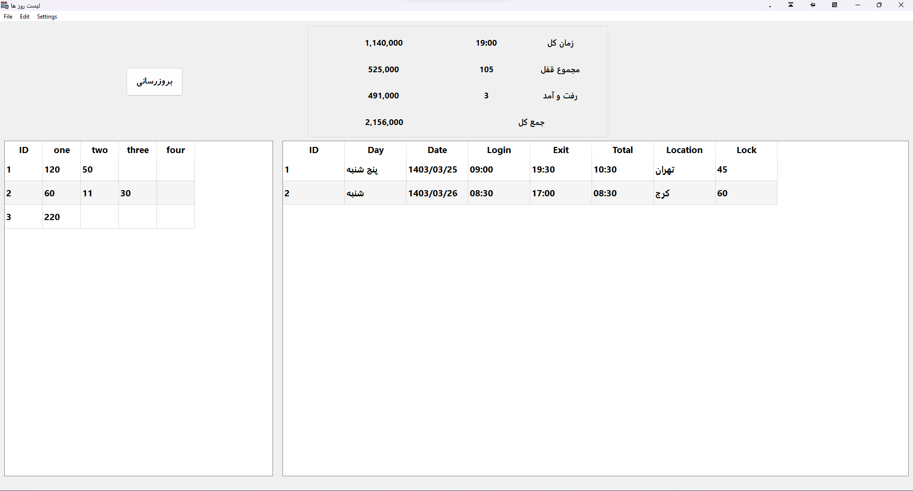

# Attendance-Tracking

This project is an attendance system that every day information such as day of the week, date, arrival time, exit time, address or location and lock .

lock here means an item that takes a share from its daily sales and is not an important thing. In the second part, for example, the amounts that are spent on commuting are collected.

---

1. Time and attendance logging
2. Registration of commuting expenses
3. The ability to log the amount for each hour and each lock

---

---

> [!NOTE]\
> This project is temporarily not being developed because it was not used.
